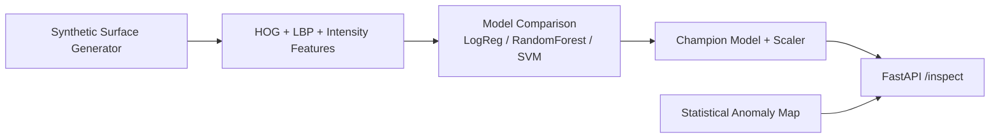
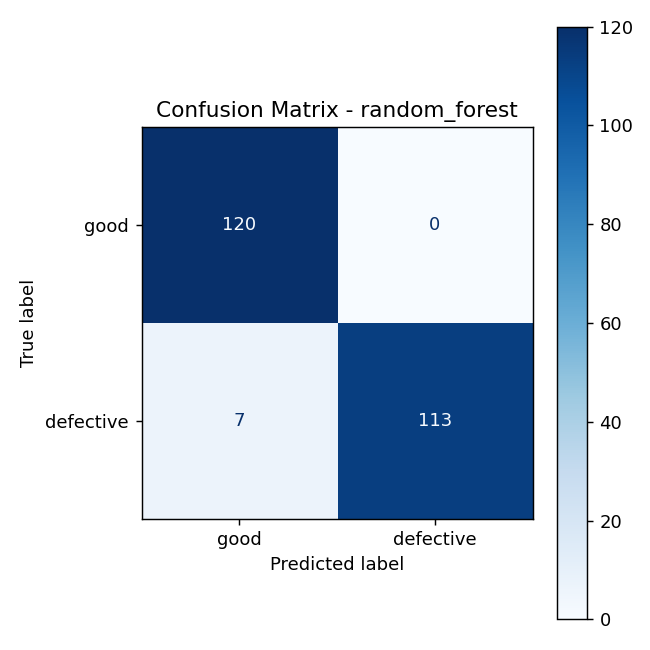
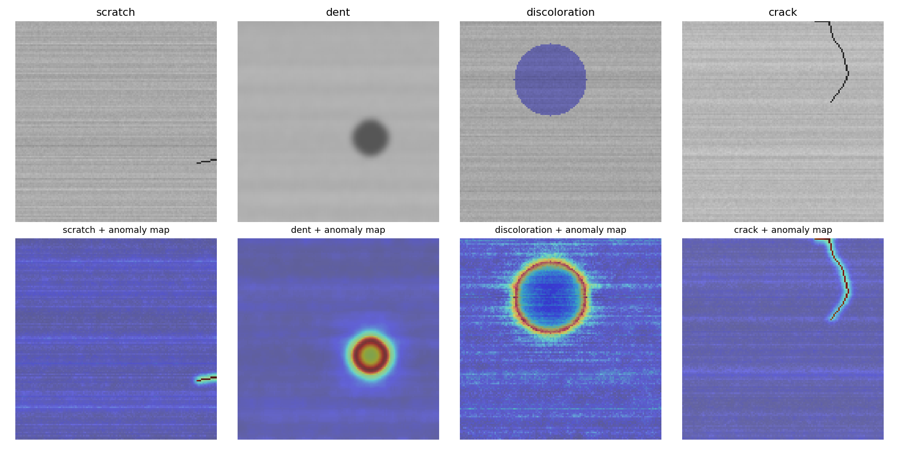

# Automated Visual Quality Inspection for Manufacturing

[](.github/workflows/ci.yml)
[](pyproject.toml)
[](src/features/extract_features.py)
[](src/models/train.py)
[](src/api/main.py)
[](docker/Dockerfile)
[](LICENSE)

A classical computer-vision defect classifier for manufacturing surface
inspection — HOG + LBP + intensity-statistic features, a tuned Random
Forest champion (F1 = 0.97, zero false alarms on the held-out test set),
and a statistical anomaly-map overlay so a QA reviewer sees *where* a part
looks anomalous, not just a yes/no verdict.

This README also documents a real dead end: the first localization approach
(occlusion sensitivity) failed a controlled test and was replaced — that
failure and pivot are in [Section 5 of the architecture doc](docs/ARCHITECTURE.md#5-defect-localization-two-approaches-one-that-failed-honestly),
not hidden.

---

## Table of Contents

- [Business Problem](#business-problem)
- [Architecture](#architecture)
- [Project Structure](#project-structure)
- [Dataset](#dataset)
- [Why Classical CV, Not a CNN](#why-classical-cv-not-a-cnn)
- [Results](#results)
- [Defect Localization](#defect-localization)
- [Installation & Usage](#installation--usage)
- [API](#api)
- [Testing & CI](#testing--ci)
- [Deployment](#deployment)
- [Future Work](#future-work)
- [License](#license)
- [Contact](#contact)

---

## Business Problem

Manual visual inspection on a production line is slow, inconsistent between
inspectors (fatigue, subjective judgment calls on borderline parts), and
doesn't scale with production volume. Missed defects become warranty
claims or recalls; over-flagging good parts wastes inspection labor and
slows the line.

**Who faces this problem:** manufacturers of any physical product with a
visible-surface quality requirement — metal parts, electronics enclosures,
textiles, packaging.

**Current industry approaches:**
- **Manual visual inspection** — the baseline, and the thing this system
  augments rather than fully replaces; inherently inconsistent between
  shifts and inspectors.
- **Rule-based machine vision** (fixed thresholds on brightness/contrast) —
  brittle to lighting changes and doesn't generalize across defect types.
- **Deep-learning vision systems** — powerful, but require either a large
  labeled dataset or GPU infrastructure to fine-tune a pretrained backbone,
  which is often disproportionate for a single-line, single-part-type
  inspection task.

**This system's approach:** a lightweight, fully-interpretable classical
CV pipeline — genuinely how a lot of real production-line inspection is
still built today, particularly on edge hardware without a GPU — that
classifies defects and shows a QA reviewer exactly where the anomaly is.

---

## Architecture

Full diagrams and the localization dead-end/pivot story in
[`docs/ARCHITECTURE.md`](docs/ARCHITECTURE.md).



---

## Project Structure

```
visual-quality-inspection/
├── src/
│   ├── data_generation/generate_images.py   # synthetic surface + defect generator
│   ├── features/
│   │   ├── extract_features.py              # HOG + LBP + intensity-stat extraction
│   │   ├── build_dataset.py                 # builds the full feature matrix
│   │   └── localization.py                  # statistical anomaly-map localization
│   ├── models/train.py                      # model comparison + champion selection
│   └── api/
│       ├── main.py                          # FastAPI image-upload inspection service
│       └── schemas.py                       # Pydantic response models
├── tests/                                   # 19 pytest tests, incl. controlled-position
│                                             #   localization correctness tests
├── configs/config.yaml                      # single source of truth for the pipeline
├── docs/                                    # architecture (incl. the failed-approach
│                                             #   writeup), API reference, deployment guide
├── docker/Dockerfile                        # runs the FULL pipeline at build time
├── docker-compose.yml
├── .github/workflows/ci.yml                 # lint, test, docker build + smoke test
├── Makefile
└── requirements.txt
```

---

## Dataset

Real manufacturing defect datasets (e.g. MVTec AD) are research-license-only
and not redistributable. `src/data_generation/generate_images.py` procedurally
generates:

- **1,200 images** (600 good, 600 defective), 128x128, brushed-metal-like
  base texture with directional streak noise + fine per-pixel grain
- **4 injected defect types** in the defective class: scratch, dent,
  discoloration, crack — each with randomized position, size, and
  orientation, so the dataset isn't trivially memorizable by pixel position
- Deterministic with a fixed seed — `make pipeline` regenerates the exact
  same dataset and gets the exact same model metrics every time

---

## Why Classical CV, Not a CNN

Ruled out for concrete, documented reasons rather than a stylistic choice:

- A from-scratch CNN on ~1,200 images would overfit or underfit
  unpredictably without a much larger dataset.
- A pretrained backbone (torchvision/HuggingFace hubs) requires network
  access this environment doesn't have.
- A full CUDA-enabled PyTorch install alone requires several GB of NVIDIA
  dependencies — checked and ruled out on disk-space grounds before writing
  any model code (`pip download` confirmed >3GB of `nvidia-cu*` packages).

HOG (edge/gradient structure) + LBP (local texture) + global intensity
statistics is also a genuine, still-common production choice for exactly
this kind of task, especially on edge hardware without a GPU.

---

## Results

Random Forest, Logistic Regression, and SVM were each tuned with
`GridSearchCV` (stratified 5-fold CV, scored on F1) and evaluated on a
held-out 20% test set (240 images, 50% defective).

| Model | Accuracy | F1 | ROC-AUC | Precision (defective) | Recall (defective) |
|---|---|---|---|---|---|
| Logistic Regression | 0.933 | 0.931 | 0.977 | 0.964 | 0.900 |
| **Random Forest (champion)** | **0.971** | **0.970** | **0.998** | **1.000** | **0.942** |
| SVM (RBF) | 0.942 | 0.940 | 0.979 | 0.973 | 0.908 |

Random Forest wins on every metric, including **perfect precision (zero
false alarms)** on the test set — meaningful for a QA tool, since false
alarms directly cost inspection labor.

<p align="center">
  
</p>

*(Regenerate with `make pipeline` — deterministic with the fixed seed, so these numbers reproduce exactly.)*

---

## Defect Localization

A binary yes/no isn't enough for a QA reviewer — they need to see *where*.
The shipped approach is a statistical anomaly map (Sobel gradient magnitude
+ deviation from a heavily-blurred local background), verified against
controlled test images with defects at known pixel positions:

<p align="center">
  
</p>

The dent and discoloration overlays show a clean ring exactly at the
defect's boundary (where the gradient is sharpest); the crack overlay
precisely traces the crack line. Defective images show a **9.1x**
raw peak-to-median contrast versus **1.8x** for clean surfaces — a real,
measurable signal, not per-image-normalized noise.

**This localization method has an honestly-documented failure behind it.**
The first approach (occlusion sensitivity — a standard, well-known
explainability technique) was tested against a controlled defect position
and failed: the model's global min/max/percentile features made it
sensitive to unrelated extreme pixels elsewhere in the image, not the
actual defect. See [`docs/ARCHITECTURE.md`](docs/ARCHITECTURE.md#5-defect-localization-two-approaches-one-that-failed-honestly)
for the full story and the exact fix.

---

## Installation & Usage

```bash
git clone <YOUR_GITHUB_URL>
cd visual-quality-inspection
python -m venv .venv && source .venv/bin/activate
pip install -r requirements.txt

make pipeline    # generate images -> extract features -> train + select champion
make api         # FastAPI at http://localhost:8002
```

## API

Interactive docs at `http://localhost:8002/docs`. Full reference:
[`docs/API.md`](docs/API.md).

```bash
curl -X POST http://localhost:8002/inspect \
  -F "file=@data/synthetic_images/defective/defective_0000_scratch.png;type=image/png"
# -> {"is_defective_predicted": true, "defective_probability": 0.718018,
#     "risk_tier": "high", "decision_threshold": 0.5, "heatmap_png_base64": "..."}
```

## Testing & CI

```bash
make test
```

19 tests across four files, including three that specifically verify
localization correctness against controlled, known defect positions (the
tests that caught the occlusion-sensitivity bug in the first place):

```
======================== 19 passed in 2.5s ==========================
```

`.github/workflows/ci.yml` runs this on every push across Python 3.11 and
3.12: ruff lint, black format check, the full `generate → extract → train`
pipeline, pytest with coverage, then a real Docker build and container
smoke-test against `/health` and `/model/info`.

## Deployment

See [`docs/DEPLOYMENT.md`](docs/DEPLOYMENT.md). The Docker image runs the
**entire pipeline at build time** — the champion model is trained and
baked into the image itself, not mounted separately, so a broken pipeline
fails the build.

```bash
docker build -f docker/Dockerfile -t visual-quality-inspection-api .
docker run -p 8002:8002 visual-quality-inspection-api
```

> As with the other repos in this series, I couldn't execute `docker build`
> itself in the sandbox used to author this project (no Docker daemon
> available there) — but every individual command the Dockerfile runs was
> independently executed and verified in isolation in that same session,
> and CI does execute a real build + smoke-test on every push.

## Future Work

- Swap the synthetic generator for real labeled inspection photos (same
  folder structure — no other code changes needed, see `docs/DEPLOYMENT.md`)
- Multi-class defect-type classification (scratch vs. dent vs. discoloration
  vs. crack), not just binary good/defective
- Active-learning loop: route low-confidence predictions to human review
  and fold labeled corrections back into retraining
- Revisit a CNN backbone if/when a larger labeled dataset and GPU
  infrastructure are available — the classical pipeline here would remain
  a fast, interpretable fallback / ensemble member rather than being
  discarded

## License

MIT — see [LICENSE](LICENSE).

## Contact

**Muhammad Farooq Shafi**
Email: [mfarooqsgafee333@gmail.com](mailto:mfarooqsgafee333@gmail.com)
LinkedIn: [linkedin.com/in/muhammadfarooqshafi](https://www.linkedin.com/in/muhammadfarooqshafi/)
Facebook: [facebook.com/profile.php?id=61575167257313](https://www.facebook.com/profile.php?id=61575167257313)
GitHub: `<YOUR_GITHUB_URL>`
