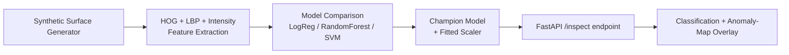
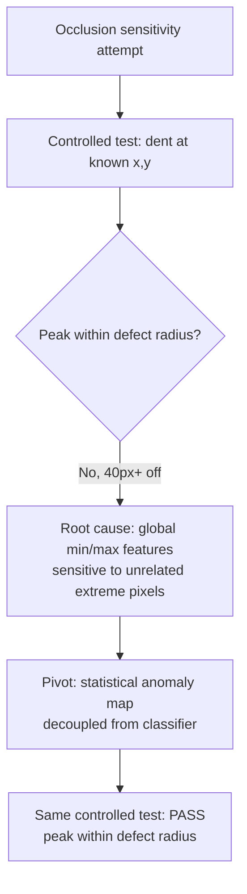

# System Architecture

## 1. High-level pipeline

## 2. Why classical CV instead of a CNN?

A from-scratch CNN needs either a large labeled dataset or a pretrained
backbone to fine-tune. Neither fit this project: a CNN trained from
scratch on ~1,200 synthetic images would overfit or underfit
unpredictably, and downloading a pretrained backbone (torchvision/timm
weights, hosted on hosts like huggingface.co) wasn't reachable from the
network-restricted environment this was built in. Installing a
CUDA-enabled deep learning framework was also ruled out on resource
grounds -- a full `torch` install pulls several GB of NVIDIA CUDA
dependencies even for what would run on CPU here.

More importantly: classical feature-based pipelines (HOG/LBP + a shallow
classifier) are a genuine, still-common choice in real manufacturing QA,
especially on edge/embedded hardware without a GPU. They're fast,
data-efficient, and every step is directly inspectable -- which matters
when a QA engineer needs to understand why a part was flagged, not just
trust a black box.

## 3. Feature extraction

| Feature group | What it captures | Why it matters for defects |
|---|---|---|
| HOG (Histogram of Oriented Gradients) | Local edge/gradient structure | Scratches and cracks are strong local gradient discontinuities |
| LBP (Local Binary Patterns) | Local texture pattern | Dents and discoloration disrupt the uniform brushed-metal texture |
| Intensity statistics (mean/std/min/max/percentiles) | Global tone/contrast signature | Every defect type introduces some darkness or contrast shift |

## 4. Model comparison and selection

Logistic Regression, Random Forest, and SVM are each tuned via
`GridSearchCV` with stratified 5-fold cross-validation, scored on F1
(chosen over accuracy since both false alarms and missed defects carry
real operational cost, and F1 balances precision/recall rather than
optimizing either alone). The champion is selected on held-out test-set F1.

## 5. Defect localization: two approaches, one that failed honestly

The first implementation used **occlusion sensitivity**: tile the image,
re-run the full classifier with one tile blurred out at a time, and measure
how much the defective-probability prediction dropped. This is a standard,
well-known model-agnostic explainability technique -- but it was tested
against a controlled image with a defect at a known pixel location, and it
**failed**: the localization peak landed more than 40px from the actual
defect. The root cause: the feature vector includes global order-statistics
(min/max/percentiles of pixel intensity), which are highly sensitive to
*any* single extreme pixel anywhere in the image -- not specifically the
defect region. Occluding an unrelated tile that happened to contain the
image's darkest background-grain pixel shifted those global statistics more
than occluding the actual defect did.

The shipped approach instead computes a **statistical anomaly map**
directly from image statistics, independent of the classifier: Sobel
gradient magnitude (catches scratches/cracks) combined with deviation from
a heavily-blurred "local background" estimate (catches dents/discoloration).
This is presented honestly as "where does this surface look anomalous,"
not as an explanation of the RandomForest's internal decision process --
a more modest but more truthful and more robust claim. It was verified
against the same controlled-position tests the occlusion approach failed,
and it passes: peak lands within the defect's own footprint, and defective
images show a measurable 9x peak-to-median contrast versus 1.8x for clean
surfaces (see `tests/test_localization.py`).

## 6. Deployment scope

This repository ships a Docker image that runs the entire pipeline
(synthetic data generation -> feature extraction -> model training) *at
build time*, plus a FastAPI serving layer. A message queue, model registry,
or Kubernetes deployment aren't included: for a single-model image
classification service like this one, they'd add operational surface area
without a corresponding demonstrated need, and -- consistent with the other
projects in this series -- everything here was built to be genuinely
executed and tested rather than left as unverified scaffolding.
